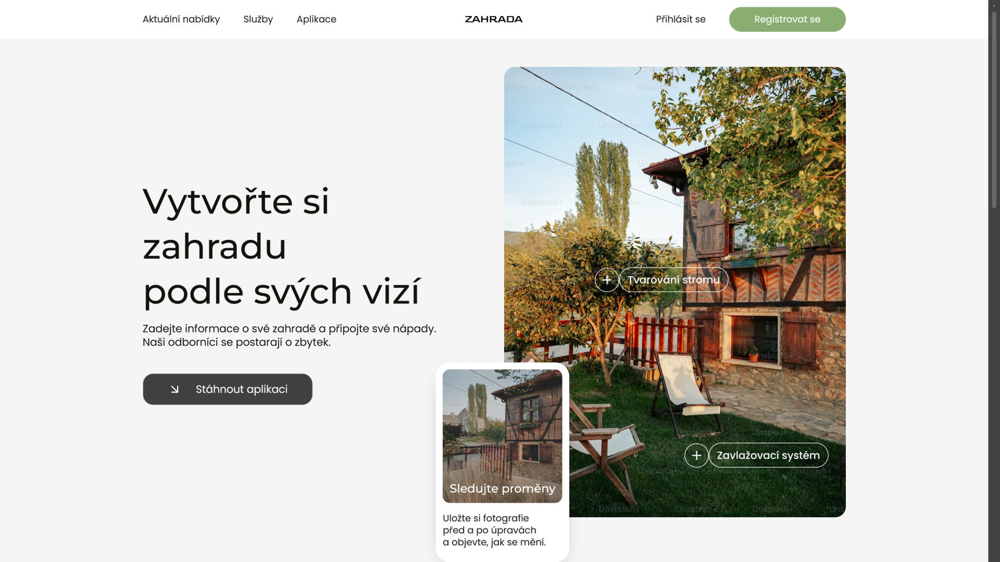

<div align="center">

# Zahrada - frontend

**React frontend for a two-sided marketplace connecting garden owners with independent gardeners.**

[Live demo](https://zahrada-frontend.vercel.app) · [Backend](https://github.com/mirovisus/zahrada_backend)


</div>



## What it does

Garden owners post requests for gardening work (lawn mowing, hedge trimming, planting, tree pruning). Gardeners browse a public catalog of open requests and submit bids with a price and short description. The owner reviews the bids, accepts one, and once the accepted gardener finishes the work, they mark it as completed for the owner's approval.

This repository contains the frontend part of the application. The API is served by a separate Spring Boot application, [zahrada_backend](https://github.com/mirovisus/zahrada_backend), which the frontend communicates with exclusively via REST with JWT authentication.

## Try it live

The live demo runs on mocked APIs (MSW), so it's always available without cold-start delays and without depending on a running backend. In-memory state resets on page reload, so the demo is always predictable.

Sign in with:

| Role | Email | Password |
|------|-------|----------|
| Owner | jnovak@seznam.cz | Demo1234 |
| Owner | evasvobodova@seznam.cz | Demo1234 |
| Gardener | petrzahr@seznam.cz | Demo1234 |
| Gardener | tomas@seznam.cz | Demo1234 |

Or create a new account. To try the full scenario (owner posts a request, gardener submits a bid, owner accepts it), sign in with both roles in two browser windows (regular + incognito).

## Screenshots


*Owner dashboard: gardens, requests and incoming bids*


*Gardener dashboard: submitted bids and active jobs*


*Request detail with current lifecycle state*

## Tech stack

React 19, Vite, React Router 7, SCSS with BEM convention, Feature-Sliced Design architecture. The demo build uses MSW (Mock Service Worker) for backend-independent deployment.

The backend the frontend talks to is a separate Spring Boot application - see [zahrada_backend](https://github.com/mirovisus/zahrada_backend).

## Key frontend features

- **Feature-Sliced Design.** Layers (`app`, `pages`, `widgets`, `features`, `entities`, `shared`) enforce one-way imports and make connections between features explicit. Cross-feature imports aren't possible; each slice exposes a public API through its `index.js`.
- **Demo build powered by MSW.** A dedicated build flag (`VITE_USE_MOCKS=true`) activates a service worker layer that intercepts fetch calls and serves data from an in-memory store seeded with realistic sample records. This lets the frontend ship as a static site without a backend while the production build stays untouched.
- **JWT client with no library dependencies.** The token lives in `localStorage`, is added to every request through a centralized API client, and triggers logout plus redirect to login on 401.
- **SCSS with BEM convention.** No CSS-in-JS, no utility framework: everything hand-written against the static design and kept in sync with a BEM class structure.

## System decisions the frontend works with

A few contractual system decisions that directly shape the frontend UX (enforced on the backend side):

- **No admin role.** The domain doesn't need one: owners manage their own gardens, gardeners their own profiles, and there's no moderation surface in this iteration. The frontend has only two dashboard types and no administrator views.
- **Simplified request lifecycle.** The implemented flow is `NEW → APPROVED → WORK_COMPLETED → WORK_APPROVED (→ CANCELLED)`. The domain enum also defines `AWAITING_PAYMENT` and `PAID` as reserved steps for payments, but the state transitions between them are intentionally not wired up: the marketplace doesn't process payments in this iteration. The UI therefore doesn't surface these states.
- **Edit restrictions after bids appear.** The backend returns HTTP 409 as soon as an owner tries to edit or delete a request that a gardener has already bid on. The frontend responds to this code with an explicit message so the owner understands why the action failed.
- **Cascading bid acceptance.** Accepting one bid atomically marks the accepted one as `ACCEPTED`, all competing ones as `REJECTED`, and the request itself as `APPROVED`. The frontend refetches the whole page's data after acceptance rather than simulating individual changes on the client.

## Running locally

Requires Node 20+.

```bash
cp .env.example .env
npm install
npm run dev
```

The app runs at `http://localhost:5173`. Full functionality requires a running backend as well (see [zahrada_backend](https://github.com/mirovisus/zahrada_backend), default address `http://localhost:8080`). Without it, sign-in and registration don't work, and API-dependent pages won't load any data.

**Demo build with mocked APIs** (no backend needed):

```bash
npm run build:demo
npm run preview
```

Other scripts:

```bash
npm run build    # production build to dist/
npm run lint     # ESLint
```

## Environment variable

The backend address is read from `VITE_API_URL` in the `.env` file at the project root (`.env` is gitignored, copy from `.env.example`).
