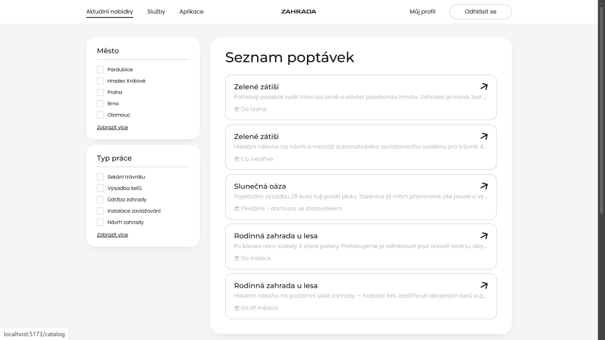
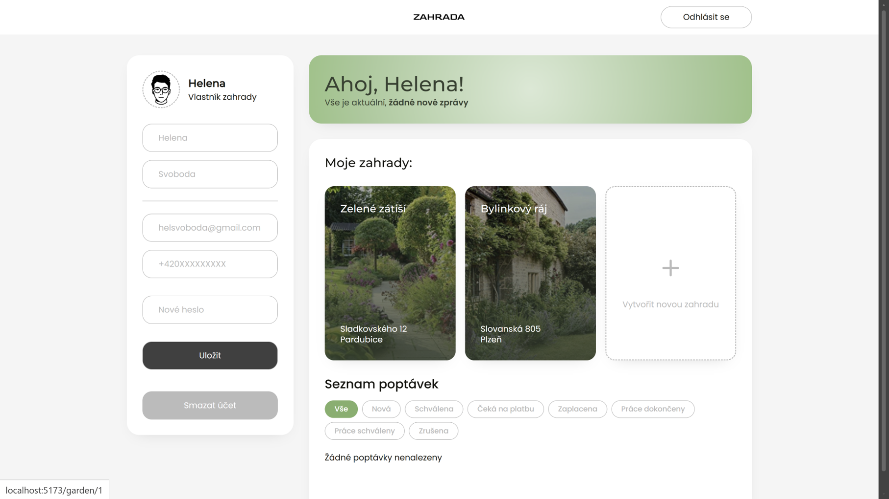
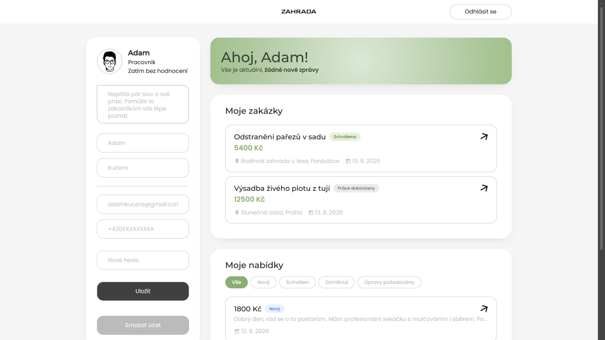
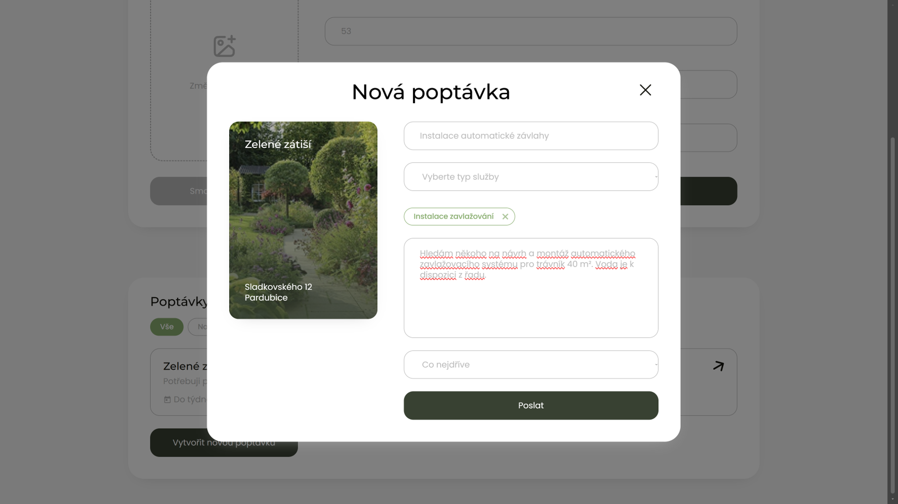

<div align="center">

# Zahrada - frontend

**React frontend pro dvoustranný marketplace propojující majitele zahrad s nezávislými zahradníky.**

[Živá ukázka](https://zahrada-demo.vercel.app) · [Backend](https://github.com/mirovisus/zahrada-backend)


</div>



## K čemu slouží

Majitelé zahrad zveřejňují poptávky na zahradnické práce (sečení trávy, stříhání živých plotů, výsadba, prořezávání stromů). Zahradníci si prohlížejí veřejný katalog otevřených poptávek a podávají nabídky s cenou a stručným popisem. Majitel si nabídky projde, jednu přijme, a přijatý zahradník po dokončení práce nahlásí její dokončení ke schválení majitelem.

Tento repozitář obsahuje frontendovou část aplikace. API poskytuje samostatná Spring Boot aplikace [zahrada-backend](https://github.com/mirovisus/zahrada-backend), se kterou frontend komunikuje výhradně přes REST s JWT autentizací.

## Vyzkoušejte živě

Živá ukázka běží na mockovaných API (MSW), takže je vždy dostupná bez zpoždění cold-startu a bez závislosti na běžícím backendu. In-memory stav se resetuje při obnovení stránky - ukázka je tedy vždy předvídatelná.

Přihlaste se pomocí:

| Role | E-mail | Heslo |
|------|--------|-------|
| Vlastník | jnovak@seznam.cz | Demo1234 |
| Vlastník | evasvobodova@seznam.cz | Demo1234 |
| Zahradník | petrzahr@seznam.cz | Demo1234 |
| Zahradník | tomas@seznam.cz | Demo1234 |

Nebo si vytvořte nový účet. Pro vyzkoušení plného scénáře (vlastník zveřejní poptávku, zahradník podá nabídku, vlastník ji přijme) se přihlaste s oběma rolemi ve dvou oknech prohlížeče (běžné + anonymní).

## Náhledy


*Přehled vlastníka: zahrady, poptávky a příchozí nabídky*


*Přehled zahradníka: podané nabídky a aktivní práce*


*Detail poptávky s aktuálním stavem životního cyklu*

## Použité technologie

React 19, Vite, React Router 7, SCSS s BEM konvencí, architektura Feature-Sliced Design. Ukázkový build využívá MSW (Mock Service Worker) pro nezávislý deployment bez backendu.

Backend, se kterým frontend komunikuje, je samostatná Spring Boot aplikace - viz [zahrada-backend](https://github.com/mirovisus/zahrada-backend).

## Hlavní rysy frontendu

- **Feature-Sliced Design.** Vrstvy (`app`, `pages`, `widgets`, `features`, `entities`, `shared`) vynucují jednosměrné importy a činí propojení mezi funkcemi explicitním. Cross-feature importy nejsou možné, veřejné API každého slice je definováno přes jeho `index.js`.
- **Ukázkový build postavený na MSW.** Samostatný build flag (`VITE_USE_MOCKS=true`) aktivuje vrstvu service workeru, která zachytává fetch volání a poskytuje data z in-memory úložiště naplněného realistickými ukázkovými daty. Díky tomu lze frontend nasadit jako statický web bez backendu, přičemž produkční build zůstává nedotčený.
- **JWT klient bez závislosti na knihovnách.** Token se ukládá do `localStorage`, přidává se do každého požadavku přes centralizovaného API klienta a při 401 spouští odhlášení a přesměrování na login.
- **SCSS s BEM konvencí.** Žádné CSS-in-JS ani utility framework - vše psáno ručně podle statického návrhu a udržováno v souladu s BEM strukturou tříd.

## Rozhodnutí, se kterými frontend pracuje

Několik smluvních rozhodnutí systému, která přímo formují UX frontendu (vynucována na straně backendu):

- **Bez admin role.** Doména ji nepotřebuje - vlastníci si spravují své zahrady, zahradníci své profily, a v této iteraci není žádná plocha pro moderaci. Frontend má tedy jen dva typy dashboardů a žádné administrátorské pohledy.
- **Zjednodušený životní cyklus poptávky.** Implementovaný tok je `NOVA → SCHVALENA → PRACE_DOKONCENY → PRACE_SCHVALENY (→ ZRUSENA)`. Doménový enum definuje také `CEKA_NA_PLATBU` a `ZAPLACENA` jako rezervovaný krok pro platby, ale přechody mezi stavy pro ně nejsou záměrně napojené - marketplace v této iteraci neprocesuje platby. UI proto tyto stavy nezobrazuje.
- **Omezení úprav po vzniku nabídek.** Backend vrací HTTP 409, jakmile se pokusíte upravit nebo smazat poptávku, na kterou už zahradník podal nabídku. Frontend na tento kód reaguje explicitní hláškou, aby vlastník rozuměl, proč akce selhala.
- **Kaskádové přijetí nabídky.** Přijetí jedné nabídky atomicky označí přijatou jako `SCHVALEN`, všechny konkurenční jako `ZAMITNUT` a poptávku jako `SCHVALENA`. Frontend proto po přijetí jednoduše obnoví data celé stránky - není nutné klientsky simulovat jednotlivé změny.

## Spuštění lokálně

Vyžaduje Node 20+.

```bash
cp .env.example .env
npm install
npm run dev
```

Aplikace běží na `http://localhost:5173`. Pro plnou funkčnost je potřeba také spuštěný backend (viz [zahrada-backend](https://github.com/mirovisus/zahrada-backend), výchozí adresa `http://localhost:8080`) - bez něj se nelze přihlásit ani registrovat a stránky závislé na API nenačtou žádná data.

**Ukázkový build s mockovanými API** (backend není potřeba):

```bash
npm run build:demo
npm run preview
```

Další skripty:

```bash
npm run build    # produkční build do dist/
npm run lint     # ESLint
```

## Proměnná prostředí

Adresa backendu se čte z `VITE_API_URL` v souboru `.env` v kořeni projektu (`.env` není v gitu, zkopírujte `.env.example`).

```
VITE_API_URL=http://localhost:8080
```

Pokud backend běží jinde, upravte hodnotu a restartujte `npm run dev` (Vite proměnné prostředí načítá jen při startu).

## Struktura projektu

```
src/
├── app/          Providery, routing, globální styly
├── pages/        Komponenty na úrovni route
├── widgets/      Kompozitní UI bloky
├── features/     Interaktivní funkce (přihlášení, podání nabídky, ...)
├── entities/     Doménové modely a jejich UI (poptávka, nabídka, zahrada, ...)
├── shared/       API klienti, utility, primitivy
└── mocks/        MSW handlery pro ukázkový build
```

## O projektu

Vytvořeno jako součást semestrální práce v předmětu KIT/BRPW2 (Ročníkový projekt II) na Fakultě elektrotechniky a informatiky Univerzity Pardubice, pod vedením Ing. Lukáše Čegana, Ph.D.
